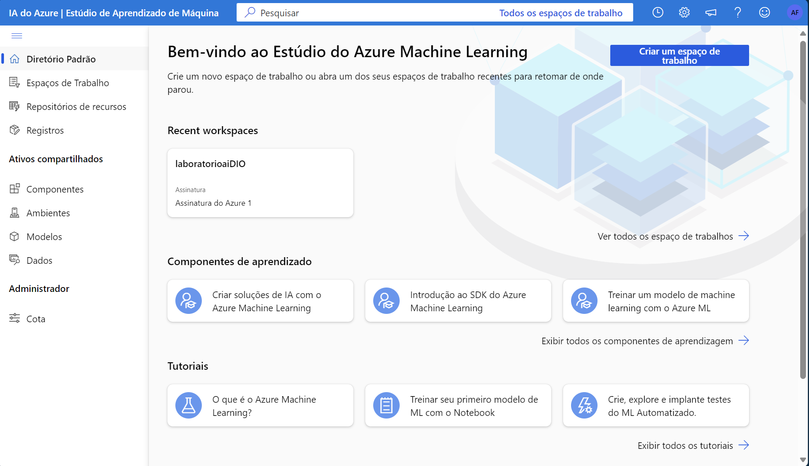
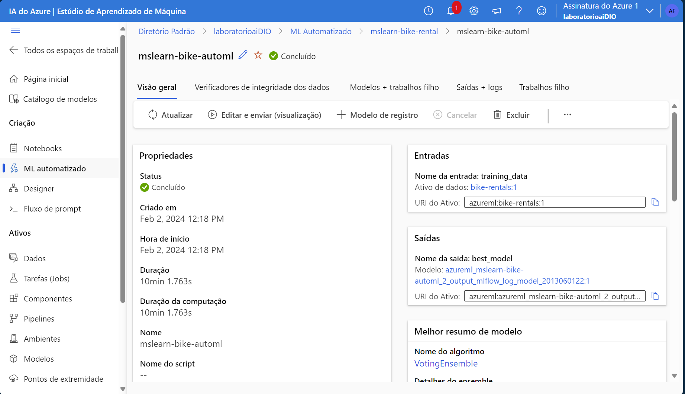
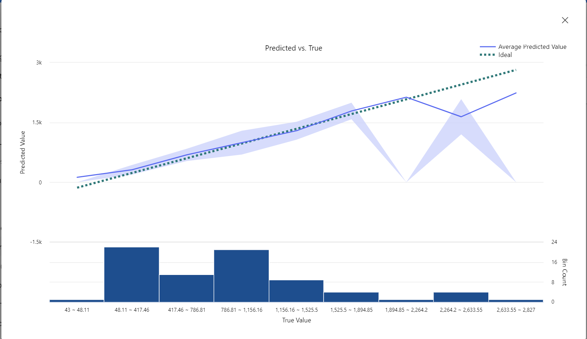

# Trabalhando com Machine Learning

A seguir, há imagens do passo a passo apresentado no vídeo e na [documentação](https://microsoftlearning.github.io/mslearn-ai-fundamentals/Instructions/Labs/01-machine-learning.html#create-an-azure-machine-learning-workspace).

Todas as intruções seguidas estão documentadas no link acima.

## Criando um espaço de trabalho no Azure Machine Learning

Inicialmente, é criado o workspace(espaço de trabalho) no Portal Azure. Podendo ser acessado como na imagem abaixo.



## Usando ML Automatizado para treinar um modelo

Como o workspace criado, é possível utilizar o ML Automatizado para obter o melhor modelo de acordo com a base de dados fornecida.


## Revisando melhor modelo

É feita a avaliação do melhor modelo encontrado, como na imagem abaixo.



Algumas métricas estão disponíveis para análise de cada modelo. Abaixo, é possível visualizar o gráfico que representa a acurácia da predições obtidas por meio da regressão.



## Implementado(deploy) o modelo

Cria um serviço Web para que seja possível utilizar o modelo treinado.


## Teste do serviço implementado

É feito um teste obtendo o resultado ```362.49143675357624```.

