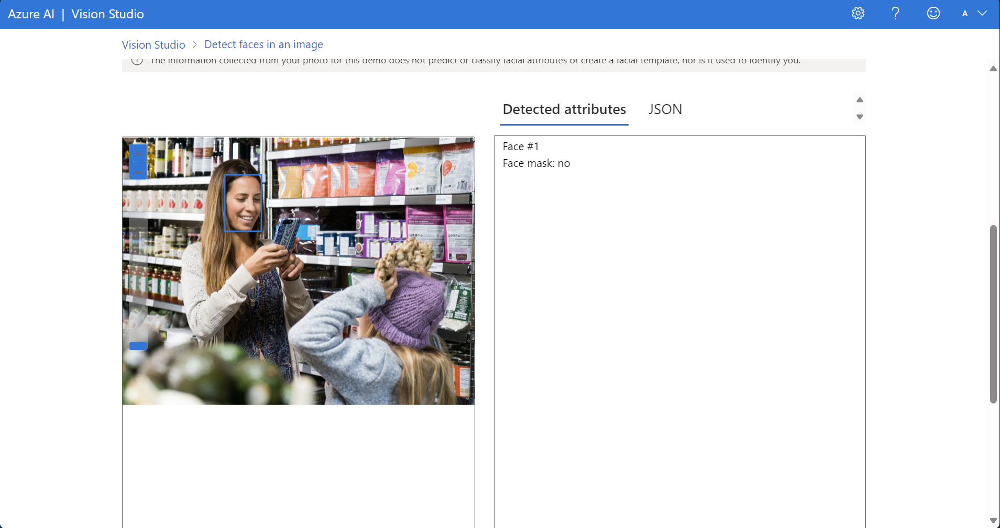
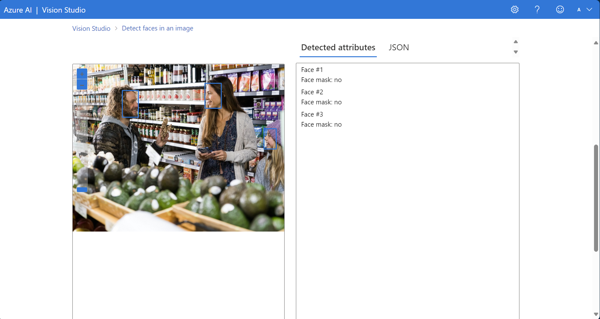
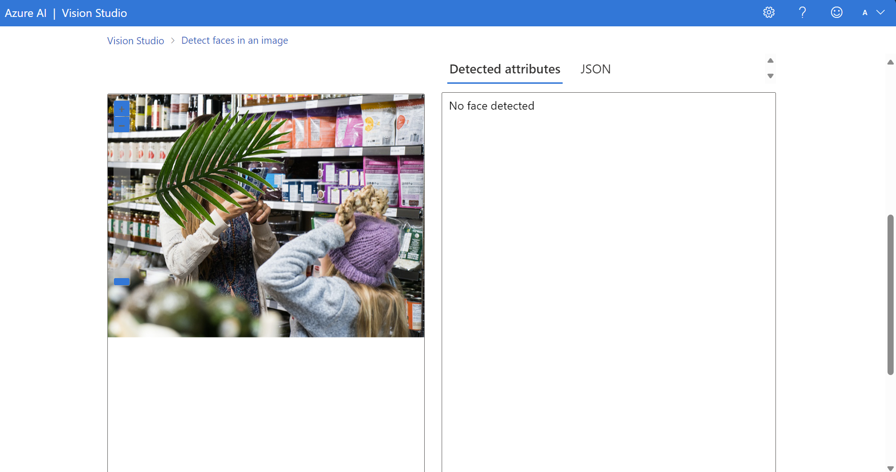
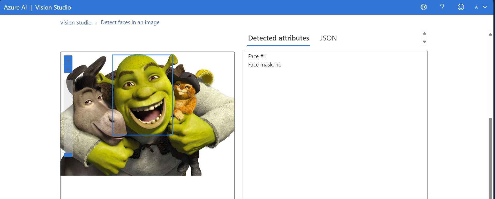
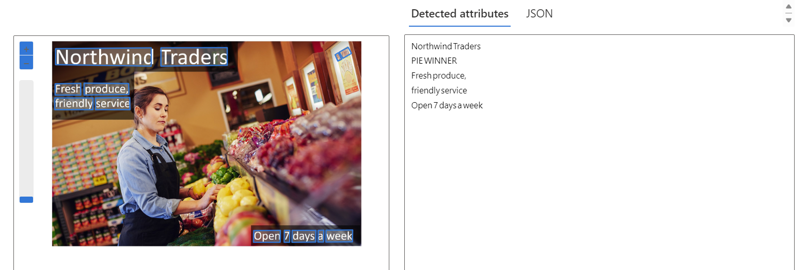
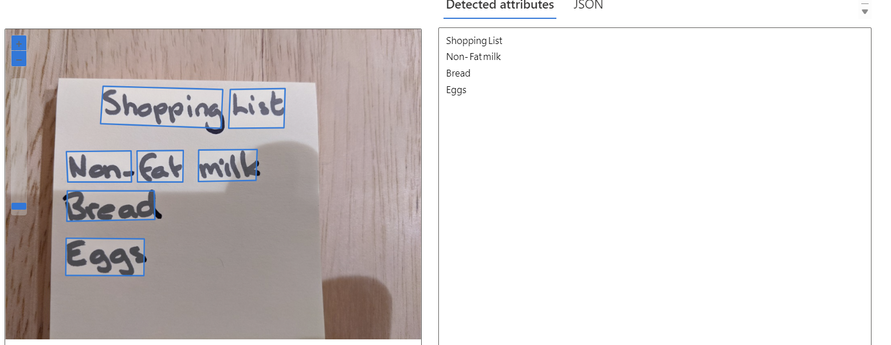
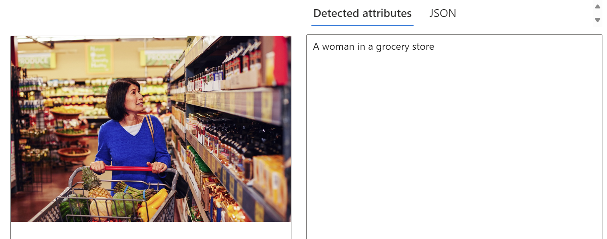
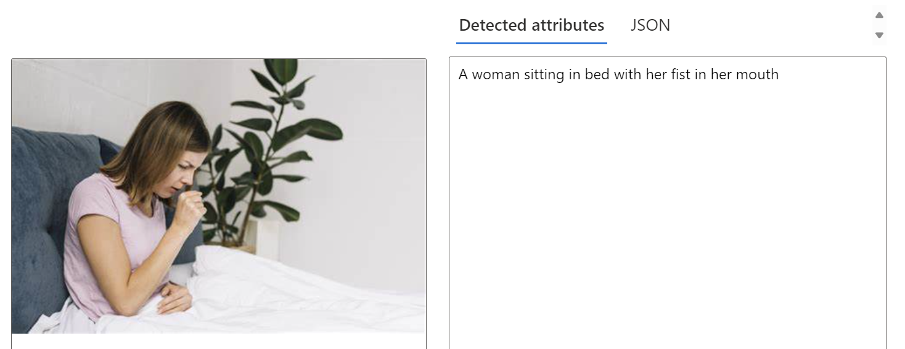

# Visão Computacional

Neste desafio de projeto, foram testadas três ferramentas do Azure relacionadas a Visão Computacional. 

## 1. Detecção de Faces

*As imagens na pasta "inputs" de 1 a 4 foram utilizados para esta funcionalidade.*

Por meio dos teste podemos ver que a detecção sofre interferência quando as faces são ocultadas. Além disso, a detecção foi capaz de reconhecer um personagem animado, o Shrek, mas não os personagens animais.

## 2. Leitura de textos em imagens

*As imagens na pasta "inputs" de 5 a 8 foram utilizados para esta funcionalidade.*

A leitura de texto é capaz de reconhecer tanto palavras digitadas quanto manuscritas.

## 3. Análise de imagens (Geração de legendas)

*As imagens na pasta "inputs" de 9 a 12 foram utilizados para esta funcionalidade.*

A Geração de Legendas acertou todos os testes e conseguiu captar diferenças nos teste 9 e 10, mesmo sendo pequena.