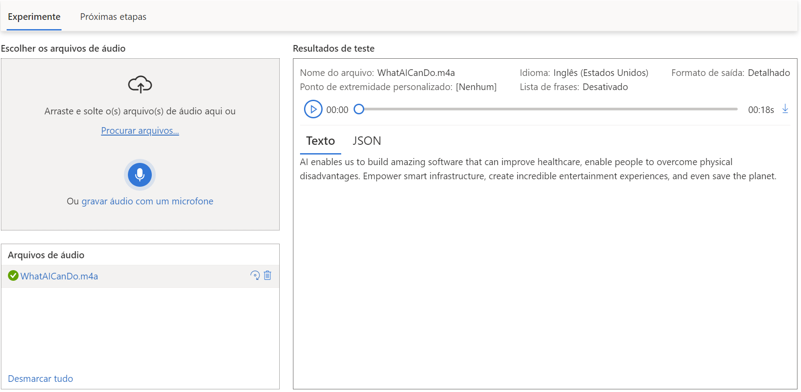
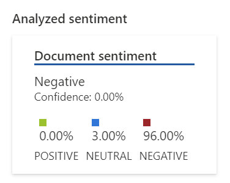
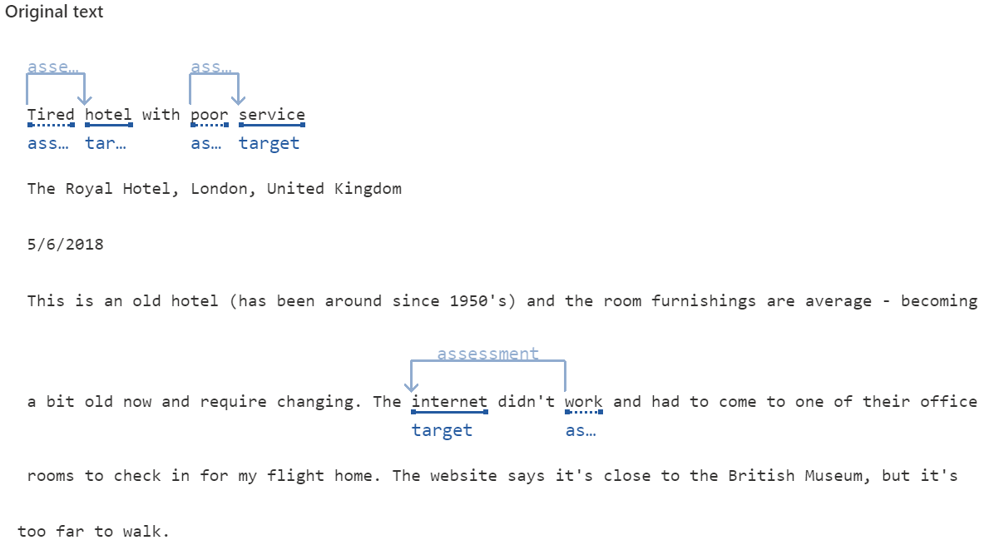
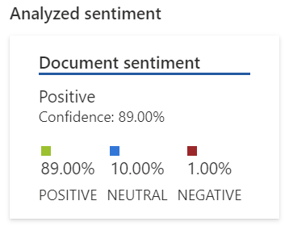
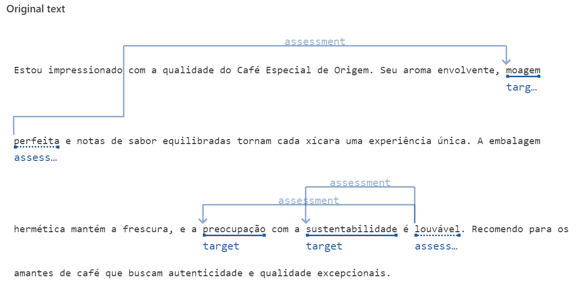

# Processamento de Linguagem Natura com Azure AI

Neste desafio de projeto, foram testados dois recursos do Azure AI relacionados a PLN (Processamento de Linguagem Natural), são eles:

## 1. Conversão de fala em texto em tempo real

*Os "inputs" utilizados foram os arquivos 'speech_teste.wav' e 'WhatAICanDo.m4a'.*

* *WhatAICanDo.m4a: áudio em inglês*

    

* *speech_teste.wav: áudio em português, gravado com o microfone do meu notebook*

    

O primeiro áudio foi convertido com exatidão para texto.

O segundo reconheceu corretamente as palavras em português, porém as inglesas foram convertidas incorretamente. Provavelmente, por erros de pronúncia do falante (😅) ou pela baixa qualidade da gravação.

## 2. Análise de sentimentos com Language Studio

*Os arquivos de texto na pasta "inputs",'lang1.txt' e 'lang2.txt', foram utilizados para teste.*

* *lang1.txt: texto com opinião negativa em inglês*

* *lang2.txt: texto com opinião positiva em português*

A análise de sentimentos dos texto foi bem precisa, tanto em inglês, quanto em português.

## Possíveis utilizações

A transcrição automatizada de fala em texto tem se mostrado inestimável em setores como o jornalismo e pesquisa, agilizando significativamente o processo de documentação e análise de entrevistas, discursos e eventos. Essa tecnologia permite uma rápida obtenção de informações precisas, economizando tempo e recursos.

Além disso, a análise de sentimentos em texto tem se destacado em áreas de marketing e atendimento ao cliente. Empresas podem agora monitorar a satisfação do cliente em tempo real, analisando feedbacks e avaliações online. Essa capacidade de compreender as emoções expressas pelos clientes não apenas ajuda a adaptar estratégias de marketing, mas também a aprimorar os serviços e produtos com base nas necessidades percebidas.